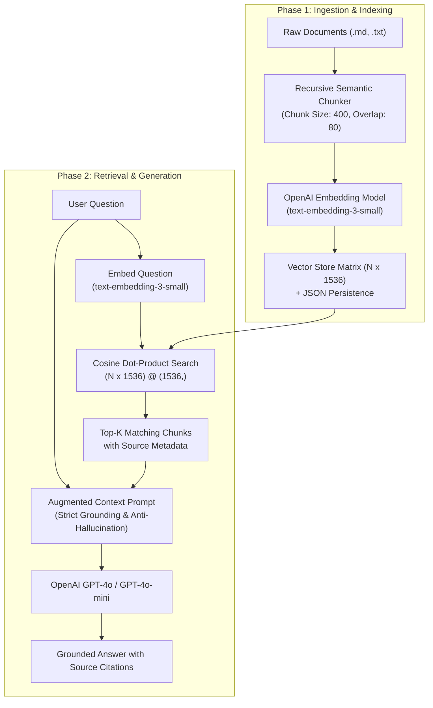

# RAG Training Suite: First Principles to Production Pipeline

> A hands-on, zero-black-box curriculum designed for **teaching and training someone HOW to create and run a Retrieval-Augmented Generation (RAG) system** from scratch using Python, NumPy, and OpenAI.

---

## 🧭 Course Philosophy: Why First Principles?

Most online tutorials immediately introduce high-level frameworks like LangChain or LlamaIndex. While those libraries are powerful, they hide the critical mechanics behind layers of abstraction:
- Students don't see what an embedding actually is.
- Students don't understand how cosine similarity is computed with dot products.
- Students don't see the exact prompt injected into the LLM.
- When hallucinations or bad retrievals happen, students have no idea how to debug them.

**This curriculum takes the opposite approach:**
We build every step—from recursive text splitting and vector math to persistent indexing and grounded prompt synthesis—using pure Python and NumPy before assembling them into a clean, production-style pipeline.

---

## 🏗️ System Architecture



---

## 📂 Project Structure

```text
RAG2/
├── .env.example                       # Example OpenAI API key & model settings
├── requirements.txt                   # Minimal dependencies (openai, numpy, tiktoken, dotenv)
├── README.md                          # Master curriculum and teaching guide
│
├── data/                              # Sample documents for training & testing
│   ├── quantum_orbit_manual.md        # Proprietary technical specs (impossible for GPT to know without RAG)
│   └── company_policy_2026.md        # HR guidelines, expenses, and leave rules
│
├── lessons/                           # 5 Step-by-Step Progressive Lessons
│   ├── lesson_01_chunking.py          # Lesson 1: Semantic splitting, overlap, token counters
│   ├── lesson_02_embeddings.py        # Lesson 2: text-embedding-3-small & cosine math from scratch
│   ├── lesson_03_vector_store.py      # Lesson 3: Building a persistent NumPy Vector Database
│   ├── lesson_04_augmented_prompt.py  # Lesson 4: Context injection, prompt engineering & RAG vs Non-RAG
│   └── lesson_05_complete_pipeline.py # Lesson 5: Assembling the complete end-to-end pipeline
│
├── src/                               # Modular, reusable production package
│   ├── __init__.py
│   ├── chunker.py                     # Document loading and recursive text chunking
│   ├── embedder.py                    # Embedding client with batching and normalization
│   ├── vector_store.py                # Pure NumPy vector database with top-k search
│   ├── generator.py                   # Context prompt formatting and OpenAI LLM client
│   └── pipeline.py                    # Unified RAGPipeline orchestrator
│
├── tests/                             # Unit tests verifying each component
│   ├── test_chunker.py
│   ├── test_vector_store.py
│   └── test_prompt.py
│
├── run_all_lessons.py                 # Automated curriculum runner that steps through all 5 lessons
└── run_rag.py                         # Interactive CLI workbench for chatting with your documents
```

---

## 🚀 Quickstart & Setup

### 1. Prerequisites
Ensure you have Python 3.10+ installed.

### 2. Configure Environment
Copy `.env.example` to `.env` and insert your OpenAI API key:
```bash
cp .env.example .env
```
Edit `.env`:
```env
OPENAI_API_KEY=sk-proj-your-actual-openai-key-here
OPENAI_CHAT_MODEL=gpt-4o
OPENAI_EMBEDDING_MODEL=text-embedding-3-small
```
*(Note: If you run without an API key, the lessons and runner include an educational simulation mode so you can study the mechanics even before setting your key!)*

### 3. Install Dependencies
```bash
pip install -r requirements.txt
```

---

## 🎓 The 5-Part Learning Curriculum

### Lesson 01: Document Loading & Chunking
* **File:** [`lessons/lesson_01_chunking.py`](file:///c:/Users/FLUXIS/RAG2/lessons/lesson_01_chunking.py)
* **What you learn:**
  - Why we chunk (context windows, embedding fidelity, needle-in-a-haystack issues).
  - The flaw in naive character splitting (cutting words in half).
  - How recursive character splitting preserves natural paragraphs, sentences, and words.
  - Why **chunk overlap** is critical to avoid severing thoughts across boundaries.
  - Counting tokens using `tiktoken`.
* **Run command:**
  ```bash
  python lessons/lesson_01_chunking.py
  ```

---

### Lesson 02: Embeddings & Vector Mathematics
* **File:** [`lessons/lesson_02_embeddings.py`](file:///c:/Users/FLUXIS/RAG2/lessons/lesson_02_embeddings.py)
* **What you learn:**
  - What an embedding is: mapping semantic text into 1,536-dimensional geometric space.
  - Calculating **Dot Product**, **Euclidean Norm**, and **Cosine Similarity** from scratch with NumPy.
  - Why normalizing vectors to unit length ($\|v\| = 1$) makes search a lightning-fast matrix dot product.
* **Run command:**
  ```bash
  python lessons/lesson_02_embeddings.py
  ```

---

### Lesson 03: Building a Vector Store from Scratch
* **File:** [`lessons/lesson_03_vector_store.py`](file:///c:/Users/FLUXIS/RAG2/lessons/lesson_03_vector_store.py)
* **What you learn:**
  - Structuring `DocumentChunk` with text, embeddings, and traceability metadata.
  - Ingestion and matrix stacking.
  - Implementing Top-$K$ nearest-neighbor retrieval with similarity score thresholds.
  - Persisting the vector database to JSON and reloading it without re-embedding.
* **Run command:**
  ```bash
  python lessons/lesson_03_vector_store.py
  ```

---

### Lesson 04: Prompt Augmentation & Anti-Hallucination Guardrails
* **File:** [`lessons/lesson_04_augmented_prompt.py`](file:///c:/Users/FLUXIS/RAG2/lessons/lesson_04_augmented_prompt.py)
* **What you learn:**
  - The "A" and "G" in RAG: turning retrieved chunks into a prompt.
  - Anti-hallucination system prompt rules ("Answer ONLY using provided context").
  - Clear citation syntax (`[Source 1: filename]`).
  - **The Direct Experiment:** Asking the LLM proprietary questions *without* RAG (fails/admits ignorance) vs *with* RAG (answers factually with citations).
* **Run command:**
  ```bash
  python lessons/lesson_04_augmented_prompt.py
  ```

---

### Lesson 05: The Complete End-to-End Pipeline
* **File:** [`lessons/lesson_05_complete_pipeline.py`](file:///c:/Users/FLUXIS/RAG2/lessons/lesson_05_complete_pipeline.py)
* **What you learn:**
  - Assembling the pieces into an automated, production-style `RAGPipeline` class.
  - Multi-document ingestion (`.md`, `.txt`).
  - Measuring latency breakdown (retrieval time vs generation time).
* **Run command:**
  ```bash
  python lessons/lesson_05_complete_pipeline.py
  ```

---

## 🛠️ Running the Interactive Workbench

Once you have completed the lessons, run the interactive CLI workbench to query the included sample knowledge base or your own files:

### Interactive Chat Mode
```bash
python run_rag.py --interactive
```
Commands inside interactive mode:
- Type your question (e.g. `What is the home office allowance?`)
- `/debug` : Toggle display of the full assembled prompt sent to the LLM
- `/stats` : View total chunks and index size
- `exit`   : Quit the workbench

### Single Query Mode
```bash
python run_rag.py --query "What is the emergency warp surge limit and what happens if exceeded?"
```

### Ingesting Your Own Documents
Place any `.txt` or `.md` files into the `data/` folder and re-index:
```bash
python run_rag.py --reindex --interactive
```

---

## 💻 Task Solver Terminal: Paste Any Task & Get Step-by-Step Solutions

You have two ways to paste any custom RAG problem or task to get an immediate architectural plan, numbered steps, runnable Python code, and test commands:

### 1. In the Web UI (Interactive Hacker Console)
1. Open the studio at **http://127.0.0.1:5050**
2. Click on the **"💻 Task Solver Terminal"** tab.
3. Paste any task (or click a quick preset like *Hybrid Search*, *Chunking with Overlap*, or *Anti-Hallucination Prompt*).
4. Click **"Execute & Generate Step-by-Step Solution"**.
5. Copy the generated code directly with the one-click **"📋 Copy Code"** button!

### 2. In Your Terminal / PowerShell
Launch the dedicated multi-line CLI solver:
```bash
python task_solver.py
```
- Paste your task (supports multi-line pastes).
- Type `/solve` and press Enter.
- The system outputs the strategy, execution steps, production code, and test commands.

---

## 🚢 Production Deployment Guide

The application is fully containerized and production-ready for deployment to any cloud provider, container cluster, or on-premise server.

### Architecture Highlights for Deployment:
- **Production WSGI Server:** Runs on **Waitress** (Windows/cross-platform) or **Gunicorn** (Linux/Docker/Cloud) with multi-worker/threaded concurrency.
- **Security Headers:** Automatic `X-Content-Type-Options: nosniff`, `X-Frame-Options: SAMEORIGIN`, and XSS protection.
- **Health Check Endpoint:** Dedicated `/api/health` and `/health` endpoints for Kubernetes probes, Docker healthchecks, and load balancers.
- **Volume Mounts:** Document data (`./data`) and the vector index (`./storage`) persist across container restarts.

---

### Option 1: Docker & Docker Compose (Recommended)
1. Ensure your `.env` contains your `OPENAI_API_KEY`:
   ```bash
   cp .env.example .env
   ```
2. Build and launch the container in the background:
   ```bash
   docker-compose up -d --build
   ```
3. Check container logs and health:
   ```bash
   docker-compose logs -f
   curl http://localhost:5050/api/health
   ```

---

### Option 2: 1-Click Cloud Deployment (Render / Railway / Fly.io / Heroku)
The repo contains pre-configured [`render.yaml`](file:///c:/Users/FLUXIS/RAG2/render.yaml) and [`Procfile`](file:///c:/Users/FLUXIS/RAG2/Procfile).

#### Deploying on Render:
1. Push this repository to GitHub or GitLab.
2. In Render Dashboard, click **New > Blueprint** and select your repository.
3. Render will automatically read `render.yaml`, set up Python 3.11, install dependencies, and launch via `gunicorn`.
4. Add your `OPENAI_API_KEY` under Environment Variables.

#### Deploying on Railway or Fly.io:
1. Run `railway up` or `fly launch`.
2. The platform will automatically detect the `Procfile` or `Dockerfile` and expose the service on the allocated `$PORT`.

---

### Option 3: Local / Windows Server Deployment
Run the production WSGI server with high-concurrency threads:
```powershell
# Windows 1-click startup
.\start.bat

# Or run server directly
python server.py
```

---

### Option 4: Linux VPS (Ubuntu / Debian) with Systemd & Nginx
1. Clone the repo to `/var/www/rag-academy`:
   ```bash
   chmod +x start.sh
   ./start.sh
   ```
2. Create a systemd service `/etc/systemd/system/rag-academy.service`:
   ```ini
   [Unit]
   Description=RAG Training Studio Production Server
   After=network.target

   [Service]
   User=www-data
   WorkingDirectory=/var/www/rag-academy
   Environment="PATH=/var/www/rag-academy/.venv/bin"
   EnvironmentFile=/var/www/rag-academy/.env
   ExecStart=/var/www/rag-academy/.venv/bin/gunicorn app:app --bind 127.0.0.1:5050 --workers 2 --threads 4

   [Install]
   WantedBy=multi-user.target
   ```
3. Enable and start:
   ```bash
   sudo systemctl daemon-reload
   sudo systemctl enable --now rag-academy
   ```

---

## 🧪 Running the Verification Test Suite

We have included automated unit tests covering chunking, vector mathematics, persistence, and prompt formatting:

```bash
python -m unittest discover tests
```

---

## 🧑‍🏫 Instructor / Trainer Guide

If you are using this repository to train a student or colleague, follow this teaching script:

1. **Start with the Problem Statement:**
   Ask the learner: *"If I ask ChatGPT what my company's internal server password or 2026 expense policy is, can it answer? Why not?"*
   Explain fine-tuning vs. RAG:
   - Fine-tuning teaches *style and task behavior*, but is expensive, slow to update, and prone to hallucinations.
   - RAG gives the model an *open book exam* by retrieving current facts just-in-time.

2. **Step Through Lesson 01:**
   - Have the learner change `chunk_size` from `400` to `50` and observe what happens to sentences.
   - Discuss why sentence overlap prevents split context.

3. **Step Through Lesson 02:**
   - Have the learner inspect the numbers in a 1536-dimensional vector.
   - Walk through the cosine similarity formula on a whiteboard or paper: $\frac{A \cdot B}{\|A\| \|B\|}$.

4. **Step Through Lesson 03:**
   - Explain how vector stores (Chroma, Pinecone, FAISS) are fundamentally matrix multiplications + indexing trees.
   - Show how saving to JSON/disk avoids re-paying for embeddings every time.

5. **Step Through Lesson 04:**
   - Show the prompt template in [`lesson_04_augmented_prompt.py`](file:///c:/Users/FLUXIS/RAG2/lessons/lesson_04_augmented_prompt.py).
   - Ask the student to remove the refusal instruction and see how the LLM starts guessing!

6. **Capstone Challenge for the Learner:**
   - Ask the student to add a new document (e.g., their own resume or a favorite recipe) into `data/`.
   - Ask them to query it and verify that the LLM cites the new document accurately!
